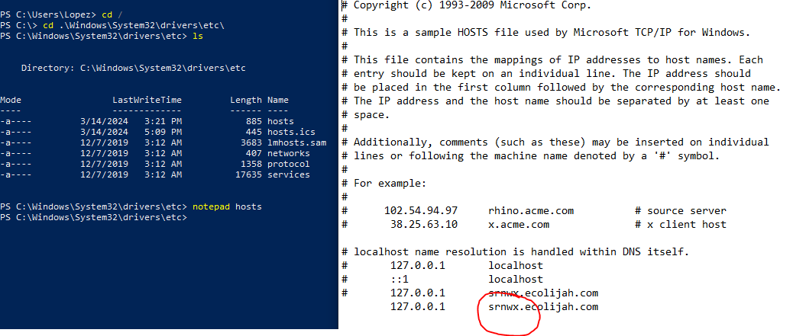

# Simplified Vercel-Like Service for React Projects

## Introduction

This [article](https://vercel.com/blog/behind-the-scenes-of-vercels-infrastructure) which describes the actual underlying infrastructure to Vercel, was what first intrigued me in this space.

I want to make it clear that this was a code along demonstrated by [Harikat Singh](https://www.youtube.com/watch?v=c8_tafixiAs&list=LL&index=22&t=7945s), that I took upon because I was interested in learning about the over-arching system design principles in a system like Vercel.

That being said, I learned quite a bit and was able to gain experience with some tools I had never touched before. (Typescript, Redis, AWS) However, the simplified system design was by far the most intriguing, and after building it, I was only more amazed at how complex and layered a product like Vercel must be. Its interesting to see the building blocks behind such a polished project, only then can you gain a sense of how much work it took.

## How it Works

**Upload Service**: 

- An express server is spun up and listening to port 3000.
- The client sends a post request (just wiht postman) with the url of the github repo they want to deploy in the body of the request.
- Using simple-git, the repo is cloned locally.
- A random id is generated and assigned to this deployment.
- One by one, the files are uploaded to an S3 bucket, classified by the id.
- A simple hash-map/dictionary database is created in redis, and the status of the current id is set to "uploaded to s3." (id : status_of_deployment)
- The id is also pushed onto a simple queue, provided by redis.

**Deploy Service**:

- An infinitely running loop pops id values from the redis queue to be deployed.
- Using the id, the correct files are downloaded from s3.
- The files are built into their distribution folder. (basically just ran npm install && npm run build on them.)
- the distribution folder, or the build files, are then uploaded back into S3.
- redis database status for current id is udated to "deployed".

**Request Handler**: 
 
(i did not want to pay for the ec2 instance to host it remotely, so i just emulated on my own machine, but it is essentially the same process. )

- a simple express server is started and listening on port 3001.
- a global catch route is listening for any requests that are pointed to my machine on port 3001.
- Get the id of your deployment and you must edit your hosts file to make the url beginning with this id point back to your machine url: 127.0.0.1. (This is done to be able to test the logic without setting up an ec2 instance and paying. It is just testing it locally, using your machine as the "server".)
- You need admin priviledges for this but heres kinda what it should look like: 
- When traffic is received, the hostname is split to find the id of the deployment. As well as the resources being requested. 
- The correct files are retrieved from s3 and sent as the response back to the client, displaying the deployment.
- I would test this by clearing the DNS cache (or open an incognito window), and visiting http://srnwx.ecolijah.com:3001/index.html, which is connected to port 3001 and requesting the resource index.html.

## Conclusions